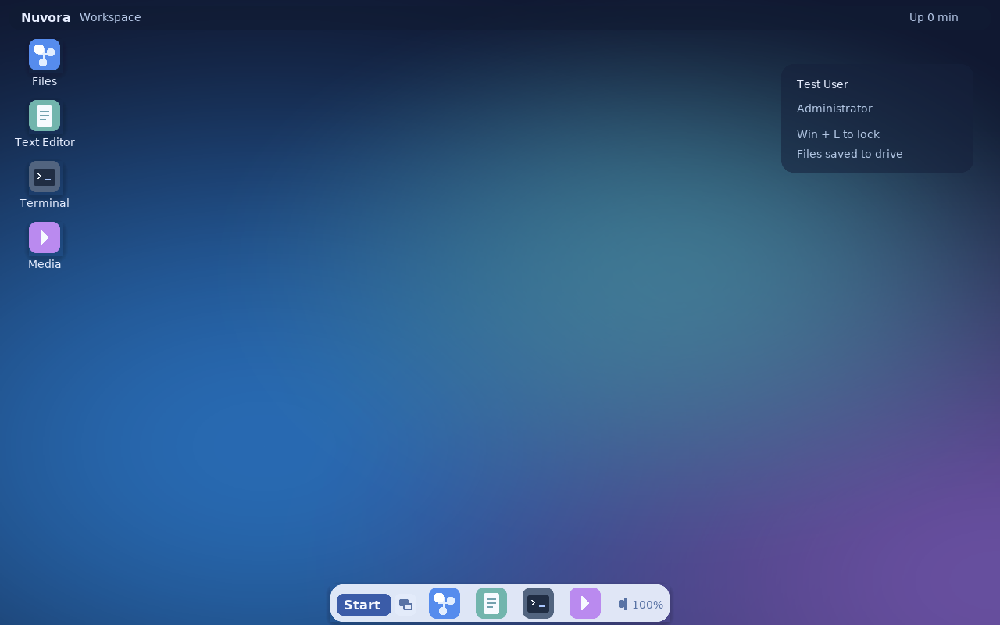
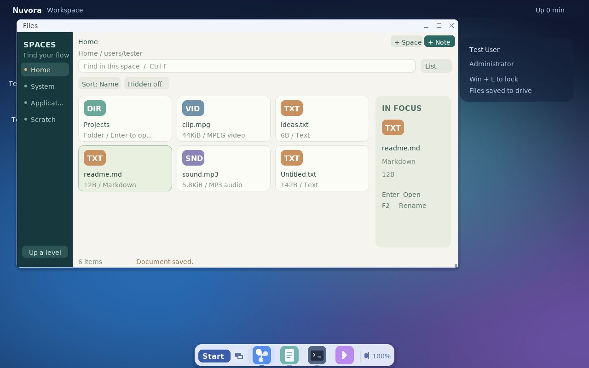
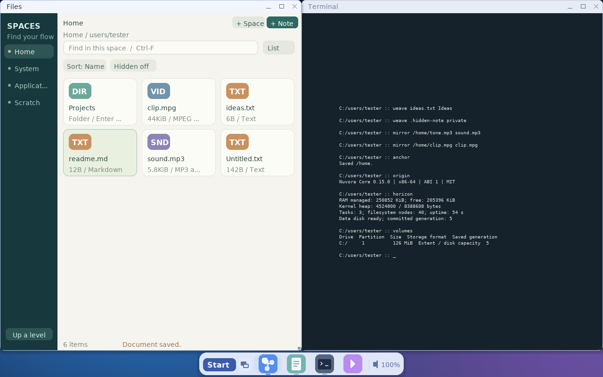
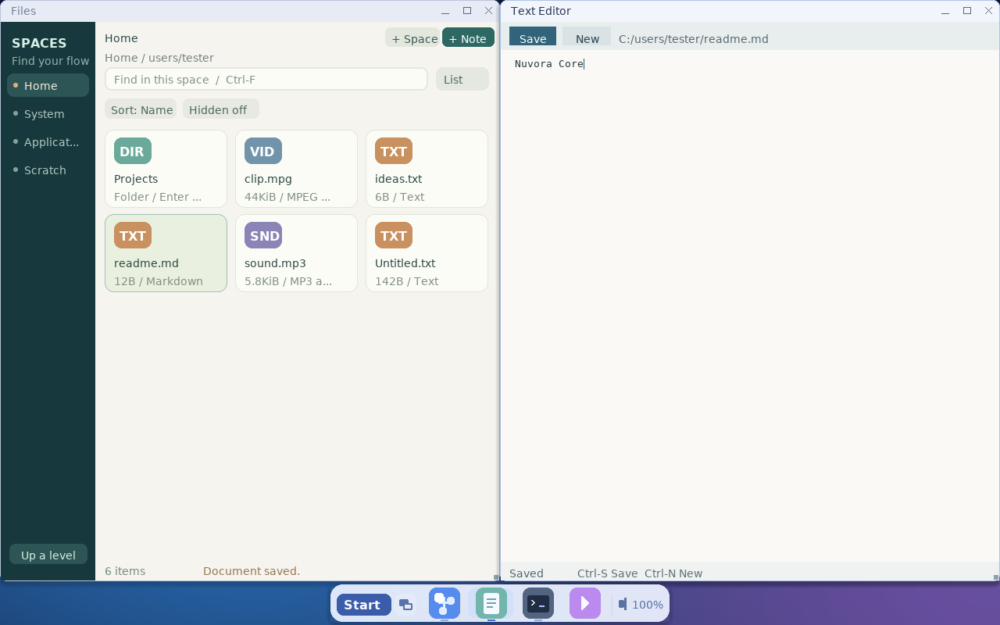
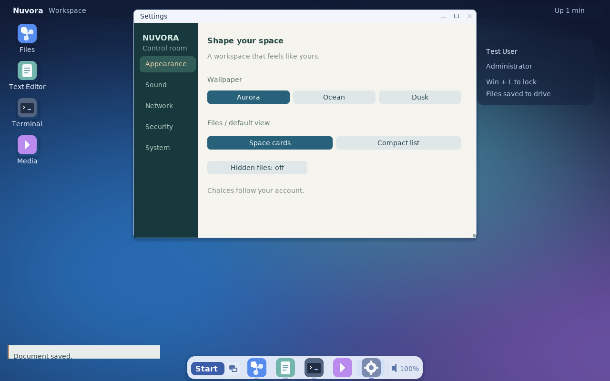
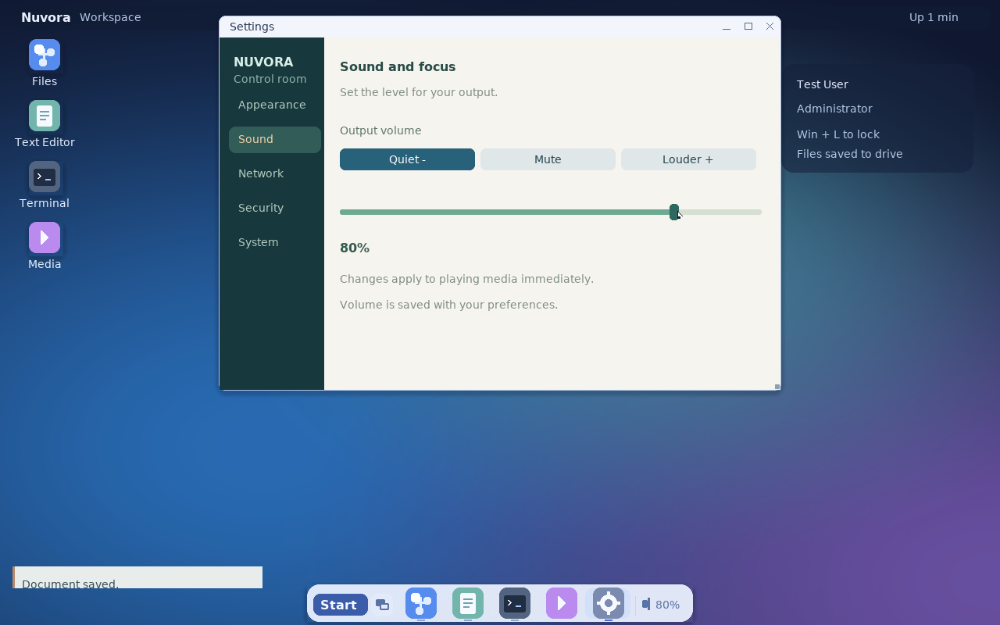
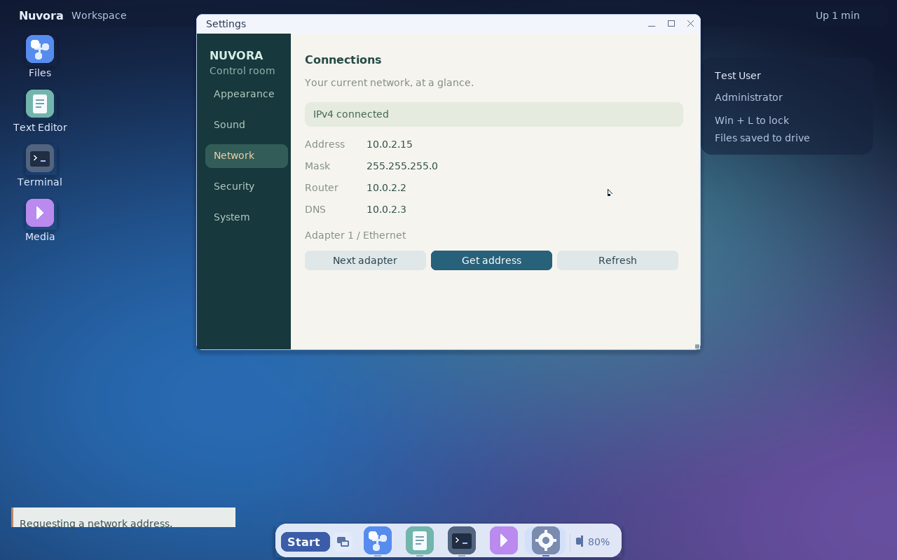

# Nuvora Core 0.15.0

Nuvora Core 是自研实验操作系统。x86-64 版本提供 UEFI/BIOS 启动、Loom 命令环境、图形桌面、自有数据卷和基础驱动；ARM64 版本目前是独立的引导与 EL0 计算基线。项目尚未完成实体机兼容认证。

0.15.0 默认进入图形登录与桌面：渐变壁纸、浮动 Dock、圆角窗口、应用搜索和设置中心。Files 采用 Nuvora 的 Spaces 界面：深青导航、暖色画布、文件类型卡片、即时搜索、排序和选中项详情。设置包含外观、声音、网络、安全和系统五页。正常启动隐藏屏幕上的内核日志，命令操作通过 Terminal 窗口完成；桌面退出后由会话监督程序恢复登录界面。内核提供自动锁屏、可信会话入口校验、管理员电源/网络配置权限、可用 CPU 上的 SMEP，以及独立诊断内核。行为与安全边界见[桌面与安全](docs/DESKTOP-SECURITY.md)。

保留 0.14.0 的原生 64 位 ABI：代码、栈、堆及图形/音频缓冲可使用 4 GiB 以上地址，兼容旧 ABI 1 ELF64 二进制。实体 PC 使用 FAT32 UEFI 启动介质、GOP 模式回退、按设备能力选择的 DMA 地址及 ACPI 电源路径；本版修正 UEFI ACPI 1.0 表 GUID，并优先选择 ACPI 2.0。上机步骤与准确边界见[实体机与 64 位说明](docs/NATIVE64-HARDWARE.md)。

## 运行截图

以下图片来自正式 x86-64 系统在 QEMU/OVMF 中的实际运行：UEFI USB 启动、
256 MiB 内存、AHCI 数据盘、USB 键盘/鼠标、e1000e 网卡和 HDA 声音。
直接截取客体帧缓冲并无损
转换为 PNG，未合成界面；这是模拟 PC 的运行结果。

桌面与浮动 Dock：



Spaces 文件管理器：类型卡片、快速搜索、排序和选中项详情。



Files 与 Terminal 并排显示，终端查看系统版本、内存和数据卷：



Text Editor 编辑并保存到数据卷，Files 显示已保存的文档：



设置中心的外观与文件视图偏好：



实际 HDA 输出音量和网络地址：





构建后运行 `python3 tests/capture_screenshots.py` 可重新拍摄；脚本使用
临时启动介质和数据盘，并核验编辑器、文件搜索打开、真实音量和 DHCP 操作。
截图和构建镜像的校验值见[截图清单](docs/screenshots/manifest.json)。

## 实体机启动

在 Linux 构建机安装 GCC、binutils、Python 3 和 mtools 后：

```sh
make -j4 all
make test-host
make media
```

将 `build/x86_64/nuvora-uefi-media.img` 写入专用测试 U 盘，在目标 PC 的
x64 UEFI 启动菜单选择它，并关闭 Secure Boot。镜像使用 FAT32 ESP，
不会自动安装或分区；写盘与存储要求见 [启动介质](docs/BOOT-MEDIA.md)。

## 开发环境快速运行

Ubuntu 或 Arch Linux 宿主安装 GCC、binutils、Python 3、QEMU、OVMF 和 mtools 后：

```sh
make -j4
make esp
python3 start.py --uefi --window --audio
```

`start.py` 默认创建 **8 GiB 稀疏 GPT 数据镜像**，保留已有镜像；`--disk-size` 以 MiB 指定新镜像容量，`--partitions 2` 可在首次建盘时生成 C:、D: 两卷。选择存储总线：

```sh
python3 start.py --uefi --window --disk-bus ahci
python3 start.py --uefi --window --disk-bus nvme
```

Arch Linux 安装依赖使用 `sudo pacman -Syu --needed gcc binutils make python git qemu-desktop edk2-ovmf mtools xorriso`。启动脚本自动识别 Arch 的 OVMF 固件布局，步骤见 [Arch Linux 指南](docs/ARCH-LINUX.md)。

Windows 10/11 在 PowerShell 中运行 `./start.ps1 doctor`、`./start.ps1 build`、`./start.ps1 run -Uefi -Window`，默认使用 WSL2 工具链。详细依赖、ISO 与独立 UEFI 启动介质见 [Ubuntu 指南](docs/UBUNTU.md)、[Windows 指南](docs/WINDOWS.md)和[启动介质](docs/BOOT-MEDIA.md)。

## 当前功能

| 范围 | 状态 |
| --- | --- |
| 内存 | x64 四级页表支持低半规范用户地址（最高 128 TiB），原生堆从 64 GiB 起、上界 64 TiB；最多管理 128 GiB 物理地址范围、2048 个启动内存图条目；按设备能力选择 DMA 范围；ARM64 上限仍为 64 GiB |
| 数据盘 | IDE、SATA/AHCI 的 512B 与 512e 盘（LBA28/LBA48），以及 512B NVMe namespace；按活动命名空间列表识别稀疏编号，旧控制器回退顺序枚举 |
| 文件 | GPT 默认一个 Nuvora 卷；NVSTORE3 支持 64 位文件大小、稀疏块和双元数据根；旧 NVSTORE1/2 可读取，解除旧容量限制需迁移 |
| 桌面与媒体 | Spaces 文件卡片/紧凑列表、搜索、排序与详情；五页设置及用户偏好恢复；三种壁纸、浮动 Dock、圆角/阴影、比例抗锯齿字体；应用搜索、总览、最近使用切换、贴边平铺及局部重绘；Text Editor、Terminal、Media、Folio；全局音量，流式播放 MP3/MP2/FLAC、WAV/RF64 和 MPEG-1/MP2 视频 |
| 账户与安全 | 图形 OOBE、登录、内核自动锁屏、退出登录；管理员/普通账户、密码修改、禁用和删除；独立用户目录、持久密码散列；管理员电源/网络配置权限，生产内核禁用测试认证绕过 |
| 外设与网络 | xHCI Boot 键盘/鼠标（含数字小键盘）、USB CDC-ECM 和基础 RNDIS 共享网络、部分 Intel 有线网卡；特定 ESP USB Dongle 固件提供 Wi-Fi 桥接；IPv4 `ping`、DNS、HTTP `wget` |

首次启动创建管理员账户，后续用密码登录。Start → Accounts 管理用户；Win-L 锁屏，Start → Sign out 退出登录。Start → Settings 调整壁纸、文件视图、输出音量和 1/5/15 分钟自动锁屏，查看网卡、内存与运行时长；管理员可请求 DHCP 地址、重启或关机。默认 5 分钟无输入由内核锁定。壁纸、文件视图/排序/点文件显示、音量和锁屏选择随用户数据卷保存，兼容原来的壁纸/锁屏偏好。账户密码要求 15–128 个字符；访问与安全边界见[账户说明](docs/ACCOUNTS.md)。

Win/Super 或 F10 打开开始菜单，输入应用名称或 `mp3`、`video` 等关键词搜索。Win-Tab 或 F12 打开窗口总览；Alt-Tab 按最近使用顺序选择，松开 Alt 切换，Shift 反向、Esc 取消。Win-左右平铺，Win-上最大化，Win-下恢复/最小化；标题栏拖到边缘也可平铺。Alt-F4/F9/F10 分别关闭、最小化、最大化/恢复。播放或下载时可操作其他窗口；Folio 关闭前保留未保存提示。任务栏和播放器可调输出音量。

Files 默认以类型卡片展示空间，宽窗口显示选中项详情；Ctrl-F 搜索当前目录，Ctrl-1/2 切换卡片/列表，F8 在名称、类型与大小排序间切换，Ctrl-H 显示点文件。可以新建、改名和删除；`.txt`/`.md` 在 Text Editor 中编辑，`.nvd` 在 Folio 中编辑，支持的音视频在 Media 中打开。终端包含完整命令集，输入 `exit` 关闭窗口；`volumes`、`partitions` 查看卷，`anchor` 提交文件改动。桌面文件操作与编辑器保存会尝试自动提交。详情见[命令](docs/COMMANDS.md)、[网络](docs/NETWORK.md)和[设备范围](docs/DEVICES.md)。

## 构建与验证

```sh
make -j4 all
make test-host
make iso-uefi   # 需要 mtools 和 xorriso
make media      # 生成 GPT/ESP 启动镜像，不写宿主磁盘
```

当前通过 39 组宿主回归，包括原生高地址页表/ELF/堆、账户权限/自动锁屏、界面边界、ACPI 电源解析、高地址 DMA 与网络配置状态清理。实际启动与桌面测试范围见[测试说明](docs/TESTING.md)。图形输出使用 GOP 软件帧缓冲，壁纸缓存与分块重绘减少输入等待；尚无 GPU 加速或实体机桌面认证。

目前只挂载 Nuvora 自有格式，**不会格式化或写入普通 Windows/Linux 分区**。4Kn 逻辑扇区、USB 存储挂载、笔记本内置 PCI Wi-Fi、USB NCM、VirtIO/SCSI、Secure Boot、多核和 Linux/POSIX 应用兼容尚未实现。完整边界与历史变更见[测试说明](docs/TESTING.md)、[架构](docs/ARCHITECTURE.md)、[路线图](docs/ROADMAP.md)和[更新记录](docs/CHANGELOG.md)。

## 许可

原创代码采用 MIT。打包的第三方组件及许可见 [third_party](third_party/README.md)；技术资料见[资料列表](docs/SOURCES.md)。
